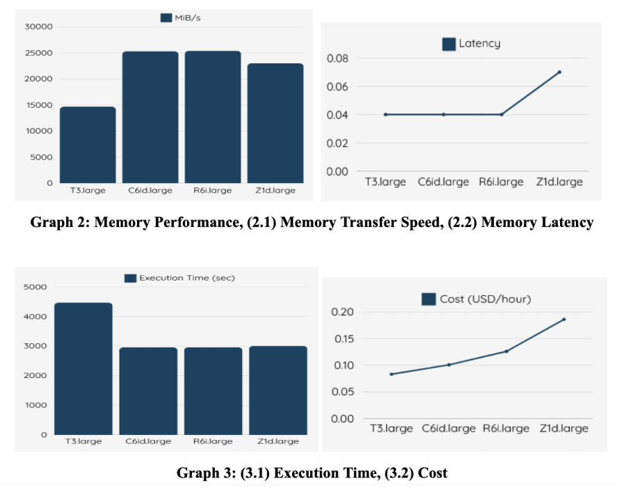
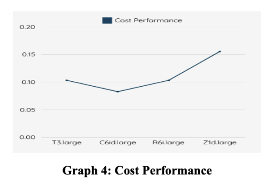

**A Comparative Analysis of EC2 Instance Types for Machine Learning: Evaluating Cost-Efficiency and Performance**

By:
- Alicia Karen Tanuwijaya (122040001)
- Keira Madeline (122040028)
- Kevin William (122040033)

From Chinese University of Hong Kong Shenzhen, School of Data Science, Computer Science and Engineering, CSC4160 Cloud Computing

**I. Overview of AWS and EC2 Instance**

Amazon Web Services Elastic Compute Cloud (AWS EC2) provides on-demand, scalable virtual servers in the cloud, enabling users to reduce hardware costs and run virtualized instances tailored to their specific needs. With a variety of instance types offering different balances of compute, memory, storage, and network resources, EC2 supports diverse applications, from web hosting to scientific computing. Its flexible pricing models accommodate varying performance and cost requirements, making performance benchmarking essential for identifying the most cost-effective and efficient instance types for specific workloads. This approach helps users optimize performance and cost, maximizing the benefits of AWS EC2 services.

**II. Background Information**

Amazon EC2 offers scalable, on-demand computing power, allowing users to optimize costs by adjusting resources to meet changing demands. It supports flexible configurations for security, networking, and storage, making it ideal for tasks ranging from small applications to resource-intensive workloads like data processing and traffic surges (Amazon Web Services (AWS), Inc. (n.d.)).

This research focuses on four EC2 instance types tailored to specific workloads. According to AWS (n.d. ), **T3.large** is a cost-effective, general-purpose instance suitable for small-scale workloads like web servers, small databases, and low-scale machine learning tasks with burstable CPU performance. **R6i.large** is optimized for memory-intensive tasks, offering high memory capacity for data processing and memory-bound workloads, delivering better performance but at a higher cost than T3.large. **C6id.large** is ideal for compute-bound tasks requiring strong CPU performance and fast local storage, excelling in I/O-intensive machine learning tasks like model training and real-time analytics. The **Z1d.large** instance is designed for high single-threaded performance workloads. It offers exceptional compute power per core, outperforming many other instance types in single-threaded performance.

This research would focus on a particular practical application program to assess the capabilities of each EC2 instance in handling the deployment and training of a Convolutional Neural Network (CNN) for image classification tasks. CNN is a deep learning model designed for image classification tasks, using layers of convolutions to extract features from images automatically (Ibm. (2024, December 2)). This code trains a CNN on image data from FashionMnist, where it performs forward propagation to calculate predictions, computes the loss using cross-entropy, and updates the parameters through backpropagation. The model's performance is evaluated using cost, which measures the difference between predictions and true labels (lower cost indicates better performance), and **test** accuracy, which reflects the percentage of correct classifications on unseen data (higher accuracy signifies better generalization). The goal of the training process is to minimize the cost and maximize the accuracy over several epochs.

This code and input data are based on the assignment provided in the DDA3020 course. In this particular implementation, only a subset of the dataset is used to reduce the training time, which is 1,000 samples from the 60,000 training images and 100 samples from the 10,000 test images, running for 20 epochs. Moreover, due to the random initialized weight value, every run, the cost, and accuracy of the test will also be random. Thus, the code results will mainly be focused on the runtime, which will be analyzed together with the performance and cost of the model of AWS EC2 instances.

This research focuses on using Sysbench tools, which evaluate system performance under various loads and measure components like CPU, memory, cost, time, and Consumption-based pricing.

**III. Objective**

Create test scenarios that mimic real-world applications to assess instance performance for machine learning to find the optimal EC2 instance type for this application and tests entail:

1. Measure time, computation, and memory performance across different EC2 instance types.
2. Collect information on benchmark tests, including CPU utilization, memory usage, execution time, cost (USD/hour), and consumption-based pricing.
3. Analyze the consumption-based pricing of T3.large, R6i.large, C6id.large, and Z1d.large instance types.
**IV. Procedure**
1. Launch EC2 Instances
  - Deploy instances (T3.large, C6i.large, R6i.large, Z1d.large) in the US East (North Virginia) region.
2. Install necessary software and prepare benchmarking
  - Set up the system by creating a Python virtual environment and installing sysbench.
3. Run ML Workloads
  - Transfer Python code to the EC2 instance using the terminal and execute the code directly on the instance
4. Monitor and Collect Results
  - Use sysbench to evaluate system performances such as CPU, memory usage, and bandwidth metrics.

**V. Data Result**

**VI. Analysis**

This report focuses on the performance of CPU and memory from using Sysbench tools, the execution time, the cost of the instance, and the consumption-based pricing.

- **CPU Performance**: How efficiently the CPU executes tasks and handles computations
- **Memory Performance**: How fast memory can be read and written
- **Execution Time:** Total runtime of the code
- **Cost:** The cost to run the AWS EC2 instance in terms of USD per hour
- **Consumption-Based Pricing:** The cost is based on how long the execution time of the code is!

**VI.I Performance Analysis of EC2 Instances**

The performance analysis of the EC2 instances, as shown in the graphs above, reveals key insights into CPU performance, memory transfer speeds, execution time, and cost. Regarding CPU performance, both the R6i.large and C6id.large instances show similar speeds, with Z1d.large coming in as the next best performer and T3.large having the lowest CPU performance. On the other hand, in terms of CPU latency, R6i.large, and C6id.large show the best latencies, followed by Z1d.large, and lastly, T3.large. For memory performance, R6i.large and C6id.large exhibit similar memory transfer speeds, while Z1d.large shows significantly lower performance, and T3.large has the lowest memory transfer speed, almost half that of the others. Thus, R6i.large and C6id.large offer the best overall CPU and memory performance. When comparing execution times, the C6id.large, R6i.large, and Z1d.large instances demonstrate similar performance, while T3.large has a notably longer execution time. In terms of cost per hour, T3.large is the least expensive, followed by C6id.large, R6i.large, and Z1d.large, with Z1d.large being the most costly.

**VI.II Cost Performance Analysis**

In terms of consumption-based pricing, C6id.large stands out as the best choice. This instance offers high CPU and memory performance, coupled with the shortest execution time and a relatively low cost per hour. While R6i.large also provides excellent performance, its slightly longer execution time and higher cost per hour make its cost performance slightly less favorable than C6id.large. T3.large, despite its lower hourly cost, has a much longer runtime, which reduces its overall cost-effectiveness compared to R6i.large. Lastly, Z1d.large has the worst consumption-based pricing due to its higher cost per hour and only moderate performance, making it the least cost-effective option overall.

**VII. Conclusion**

In conclusion, this project aims to analyze the best instance to use when trying to run a machine learning code. After testing between four types of instances, which are T3.large, R6i.large, C6id.large, and Z1d.large, it is found that C6id.large is the most promising instance to use. C6id.large has the best CPU and memory performance among the other instances. Moreover, C6id.large also has a good cost and low execution time, which gives it the best consumption-based pricing among all instances tested. However, it is important to acknowledge the limitations of this project. Due to time constraints, the dataset used for testing the EC2 instances was limited, which may impact the true execution time of each instance. Furthermore, only four EC2 instance types were used to analyze the Consumption-based pricing, which is far less than what AWS EC2 offers. A broader selection would have allowed for a more comprehensive comparison. Additionally, the study focused primarily on machine learning workloads, particularly the CNN models, which may not fully reflect the performance of other instance types.

**References**

Amazon Web Services, Inc. (n.d.)*. Compute – Amazon EC2 instance types – AWS.*

<https://aws.amazon.com/ec2/instance-types/>

Amazon Web Services, Inc. (n.d.). *What is Amazon EC2? - Amazon Elastic Compute Cloud*.

<https://docs.aws.amazon.com/AWSEC2/latest/UserGuide/concepts.html>

Ibm. (2024, December 2). *Convolutional Neural Networks. What are Convolutional Neural Networks?*

<https://www.ibm.com/think/topics/convolutional-neural-networks>

